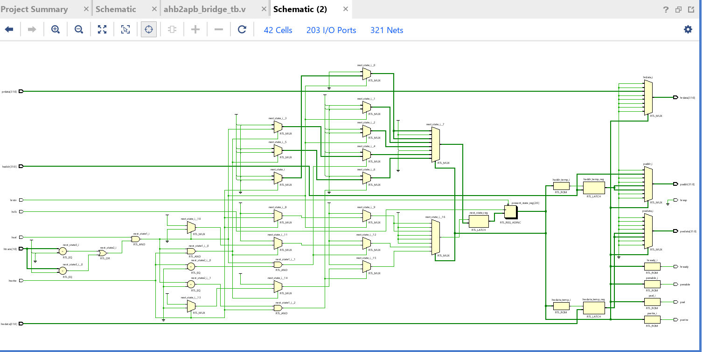
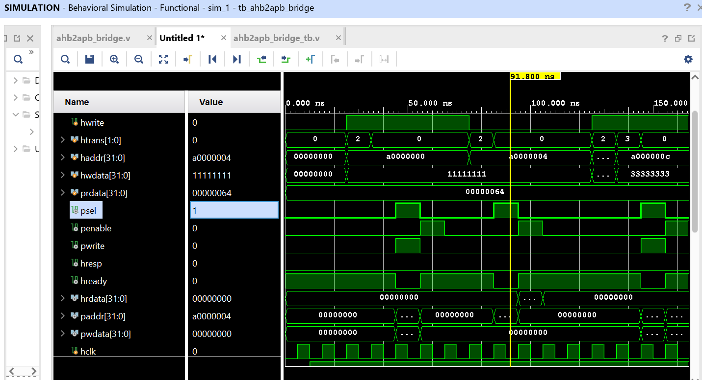

# AHB to APB Bridge Design in Verilog

A system to interface **AHB (Advanced High-performance Bus)** with **APB (Advanced Peripheral Bus)**, allowing seamless communication between high-speed and low-speed components in a system-on-chip design.

---

## Table of Contents
- [About the Project](#about-the-project)
- [Features](#features)
- [How It Works](#how-it-works)
- [Schematic](#schematic)
- [Setup Instructions](#setup-instructions)
- [Simulation Results](#simulation-results)
- [License](#license)

---

## About the Project

This project implements an **AHB to APB Bridge** in Verilog for efficient data transfer between two AMBA protocols. The bridge handles:
- AHB sequential and non-sequential transfers.
- APB setup and enable phases.
- Read and write transactions.

The design is **fully synthesizable** and **simulated successfully** with Verilog testbenches.

---

## Features
- ✅ Supports AHB Non-sequential (NONSEQ) and Sequential (SEQ) transfers.
- ✅ Converts AHB transactions to APB format.
- ✅ Supports read and write operations.
- ✅ Fully synthesizable Verilog design.
- ✅ Functional verification with testbench.


---

## How It Works
1. **AHB Master** initiates the transaction.
2. **Bridge** checks transfer type (NONSEQ or SEQ).
3. Bridge translates signals to **APB protocol**.
4. APB completes **setup** and **enable** phases for peripheral access.
5. Read or write is performed, and response is sent back to AHB.

---


## Schematic



---

## Setup Instructions
1. Clone the repository:
    ```bash
    git clone https://github.com/your-username/ahb2apb_bridge.git
    ```
2. Open the project in Vivado/ModelSim.
3. Compile all source and testbench files.
4. Run the simulation and verify results.

---

## Simulation Results

Example:



---

## License
This project is licensed under the MIT License - see the [LICENSE](./LICENSE) file for details.


